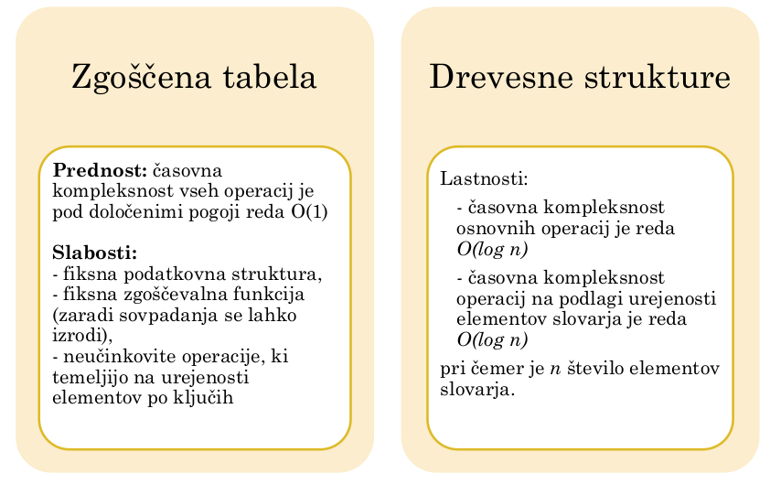

## Slovar (Dictionary)

`Slovar (dictionary)` - poseben primer ADT mnozica, ki omogoca:

- **brisanje**
- **vstavljanje**
- **iskanje** elementov.

Za ucinkovito iskanje elementov potrebujemo relacijo **Urejenosti** med elemeneti.

### Osnvovne operacije

- `makenull()` - naredi prazen slovar D
- `member(x, D)` = preveri, ce je element x v slovarju D
- `insert(x, D)` - vstavi element x v slovar D
- `delete(x, D)` - zbrise element x iz slovarja D

Zaradi urejenosti elementov elementov v slovarju je mozno ucinkovito implementirati tudi operacije:

- iskanje minimalnega elementa
- iskanje maksimalnega elementa
- iskanje predhodnika (predecessor)
- iskanje naslednika (successor)
- izpis elementov na danem intervalu

### Primeri uporabe

- slovar crkovalnika: pri ckrvoanju je treba hitro preveriti, ce je dana beseda v slovarju; uporabnik lahko dodaja nove besede v slovar
- kompresija besedila zahteva izracun frekvence vsake besede: slovar kreiramo tako, da bsede dodajamo v slovar in sproti posodabljamo frekvenco
- vsaka **podatkovna** baza je pravzaprav slovar:
  - elementi so urejeni po kljucih, zaradi hitrega iskanja
  - ker so baze shranjene na pocasnem disku, je treba izbrati podatkovno strukturuo, ki minimizira stevilo dostopov do diska

### Implementacija slovarja

> Pri zgosceni tabeli se lahko izrodi O(n), ter rehashing, pri drevesnih strukturah je O konstaten
