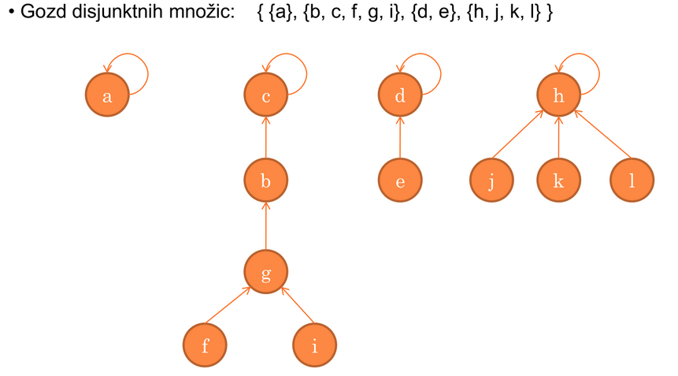
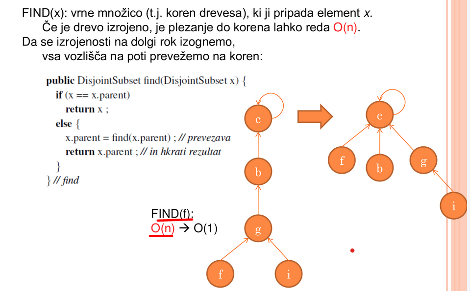
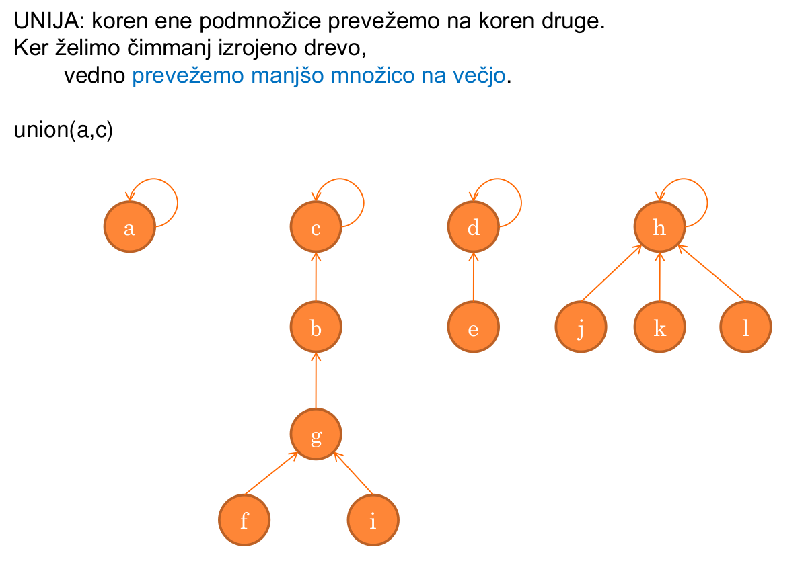
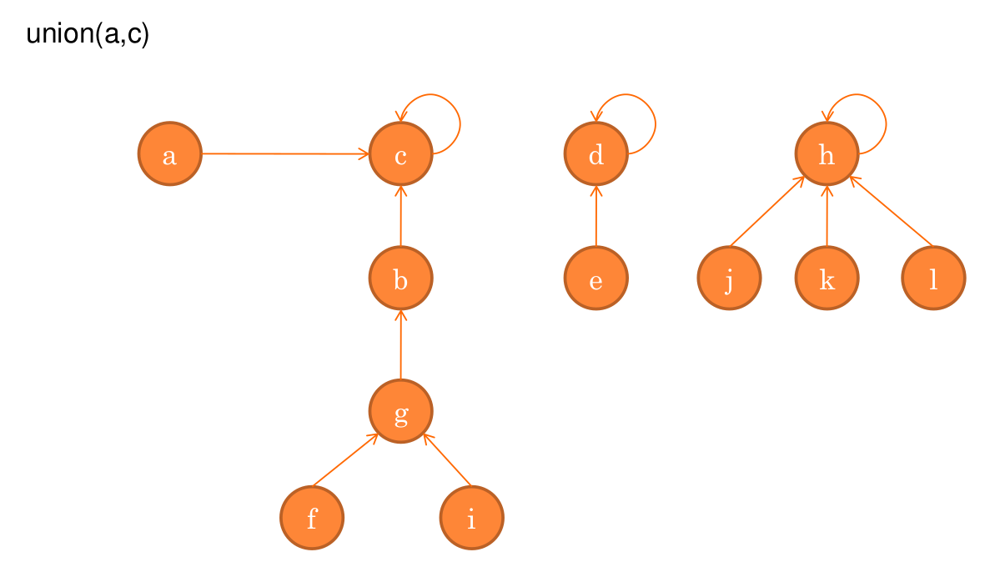
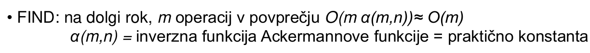
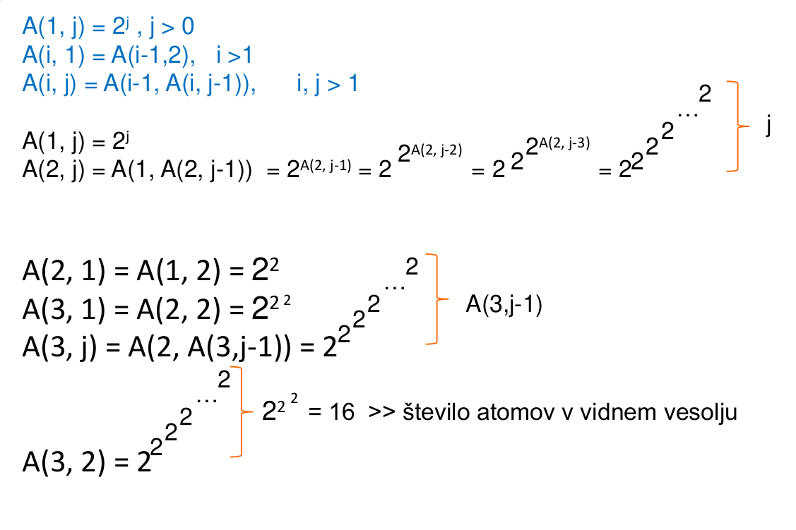

## Disjunktne mnozice - ADT Disjoint sets

- Spadajo pod drevesni abstraktni podatkovni tip
- Mnozico elementov zelimo razbiti na **disjunktne podmnozice** glede na neko relacijo med elementi
- Gradimo mnozice od spodaj navzgor:
  - Vsak element je ena podmnozicqa
  - Manjse podmnozice zdruzujemo v vecje podmnozice, ce so elemente iz ene in druge podmnozice v isti relaciji
- Za vsak element moramo vedeti, kateri podmnozici pripada

### Operacije

- `makenull(S)`: generira prazno mnozico S
- `makeset(x,S)`: tvori novo mnozico {x} in jo doda v S
- `union(A1, A2, S)`: zdruzi dve disjunktni podmnozici A1 in A2 v novo podmnozico
- `find(x, S)`: vrne podmnozico, katere element je x

### Implemenatacija z gozdom

- Vsaka mnozica je drevo
- Vsak element kaze na oceta v drevesu
- Koren kaze sam nase
- Mnozica je identificirana s korenom

#### Operacija find(x)

- Vrne mnozico (t.j. koren drevesa), ki ji pripada elemente x. Ce je drevo izrojeno, je plezanje do korena red $O(n)$
- Da se izrojenosti na dolgi rok izognemo, vsa vozlisca na poti prevezemo na koren:

#### Operacija Unija

#### Zahtevnost operacij

| Operacija | Casovna zahtevnost |
| --------- | ------------------ |
| makenull  | O(1)               |
| makeset   | O(1)               |
| union     | O(1)               |
| find      | O(m)               |

#### Ackermannova funkcija

