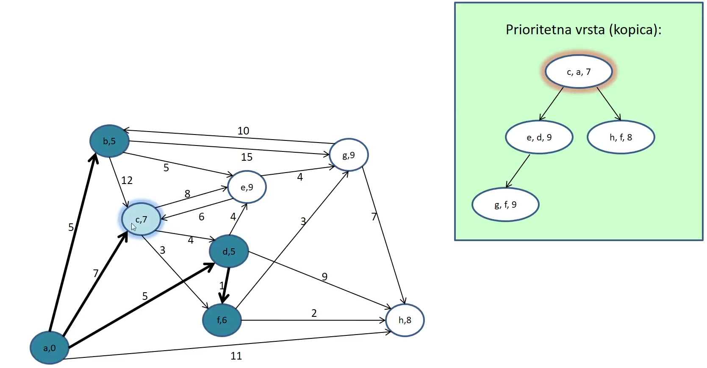

# Grafi

## Usmerjeni graf - Directed Graph

- `usmerjeni grad (directed graph)`: je podan z urejenim parom G=<V,E> je podan z mnozico vozlisc `V` in mnozico povezav `E`
- **povezava** je **urejen** par vozlisc:
  - prvemu vozliscu pravimo **zacetek** povezave, drugemu pa **konec** povezave
  - zacetek in konec povezave je lahko isto vozlisce
- **izstopna stopnja (outdegree)**: vozlisca v je stevilo povezav, ki imajo to vozlisce kot svoj zacetek
- **vstopna stopnja (outdegree)**: vozlisca v je stevilo povezav, ki imajo to vozlisce kot svoj konec
- graf je **poln (fully connected)** ce je vsako vozlisce povezano z vsakim drugim vozliscem (vkljucno samo s sabo)

> Stevilo povezav polnega grafa: $n\cdot n$

- **pot (path)** v grafu G = <V, E> je zaporedje vozlisc
- **drevo** je usmerjeni aciklicni graf, kjer je vsako vozlisce dosegljivo iz korena na natanko eni poti
- **podgraf** danega grafa G=<V,E> je graf G'=<V',E'>, tako da
  $$V'\subset V \land E'\subset E$$
- Za ocenjevanje casovne zahtevnosti algoritmov na grafih je za velikost problema:
  - $n=|V|$ (stevilo vozlisc)
  - $m = |E|$ (stevilo povezav)

<p align="center"></p>

### Operacije

<p align="center"></p>

### Implementacija s Seznamom Sosednosti (adjacency list)

- usmerjeni graf ucinkovito implementiramo s **seznamom sosednosti (adjacency list)**:
  - vozlisca tvorimo v seznamu
  - vsako vozlisce ima seznam povezav, ki vodijo iz vozlisca
  - vsaka povezava hrani se kazalec na konec poveave
- Casovna zahtevnost vseh operacij reda **O(1)**

<p align="center"></p>

### Operacije

- Vse operacije `O(1)`

<p align="center"></p>

## Neusmerjeni grafi - Undirected Graph

- **neusmerjeni graf (undirected graph)** G=<V,E> je podan z mnozico vozlic V (vertices) in mnozico poezav E (edges)
- povezava je **neurejen** par vozlisc
  - vozlisci sta dva **konca** povezave
  - povezani vozlisci sta **sosedni** (adjacent)
  - dva konca povezave sta <u>razlicni</u> vozlisci
- **stopnja** (degree) vozlisca v je stevilo povezav s katerim je to vozlisce eden od koncev (st sosedov)
- graf je **poln (fully connected)**: ce je vsako vozlisce povezano z vsakim drugim vozliscem (sam s seboj ne more biti)

> St povezav v polnem grafu: $\frac{n(n-1)}{2}$

<p align="center"></p>

## ADT NEUSMERJENI GRAF (graph)

- ADT graph je definiran z naslednjimi operacijami:

<p align="center"></p>

### Implementacija neusmerjenega grafa

- Implementiramo ga kot **usmerjeni graf**, kjer je vsaka povezava podvojena (dvosmerna)
- neusmerjeni graf ucinkovito implementiramo s `seznamom sosednosti (adjacency list)`
- casovna zahtevnost vseh operacij je $O(1)$

<p align="center"></p>

#### Casovna zahtevnost operacij

<p align="center"></p>

---

# Grafovski Algoritmi

## Analiza Kriticne Poti

V neusmerjenem grafu <u>**brez ciklov**</u>!.

`Dinamicno programiranje`:

- graf pregledujemo od zacetka projekta proti koncu
- hranimo seznam vozlisc, za kateresmo pregledali ze vse poti do njih, nismo pa se pregledali njihovih naslednikov
- za vsako vzolisce hranimo cas maksimalne poti, ki vodi do njega
- zato, da ugotivmo, ce smo pregledali vse poti, ki vodijo do vozlisca, potrebujemo vstopno stopnjo vozlisca, ki se med iskanjemzmanjsa ob pregledu vsake nove poti
- ce zelimo izpisati se kriticno pot, shranimo se predhodnika na maksimalni poti

### Primer1

- Podan je graf na sliki izracunajte kriticno pot v grafu.

<p align="center"></p>

1. `Inicializacija`: v vozliscih shranimo:
   - predhodno vozlisce
   - maksimalen cas do vozlisca
   - stevilo se ne pregledanih vhodov

<p align="center"></p>

2. `Zanka` postopka:

   - Hranimo seznam vozlisc, katerih naslednikov se nismo pregledali, **v seznam dodajamo samo vozlisca, katerim smo pregledali vse vhode**

   <p align="center"></p>

   - vzamemo prvega v vrsti in pregledamo vse iztopne povezave (v poljubnem vrstnem redu)
     - takoj ko ima vozlisce stevilo se ne pregledanih vhodov == 0, ga dodamo v seznam

   <p align="center"></p>

   <p align="center"></p>

   <p align="center"></p>

   - Ko pregledamo vse naslednike nase vozlisca, vzamemo prvega v vrsti in postopek nadaljujemo

       <p align="center"></p>

     - ce pridemo do vozlisca v katerem smo ze bili, ter najdemo daljso pot, posodobimo vozlisce

       <p align="center"></p>

       <p align="center"></p>

       <p align="center"></p>

   - Pregledali smo vse naslednjike: pogledam seznam kandidatov in nadaljujem pri prvem v vrsti:

       <p align="center"></p>

       <p align="center"></p>

       <p align="center"></p>

       <p align="center"></p>

   - Pregledali smo vse naslednike vozlisca <u>c</u>, vzamem prvega iz vrste: <u>d</u>

   <p align="center"></p>

   <p align="center"></p>

   <p align="center"></p>

   - Pregledali smo vse naslednike vozlisca <u>d</u>, vzamemo prvega iz vrste: <u>e</u>

   <p align="center"></p>

   <p align="center"></p>

   - Nadaljujem pri prvem v vrsti

   <p align="center"></p>

   <p align="center"></p>

   <p align="center"></p>

   <p align="center"></p>

   - Nadaljujem pri prvem v vrsti

   <p align="center"></p>

   <p align="center"></p>

   <p align="center"></p>

   - Nadaljujem pri prvem v vrsti

   <p align="center"></p>

   <p align="center"></p>

   - Nadaljujem pri prvem v vrsti

   <p align="center"></p>

   <p align="center"></p>

   <p align="center"></p>

   - Nadaljujem pri prvem v vrsti

   <p align="center"></p>

   <p align="center"></p>

   - Ko pri koncenm pregleadmo vse predhodnike koncamo s postopkom

       <p align="center"></p>

     - pot rekonstruiramo

   <p align="center"></p>

### Primer2

<p align="center"></p>
<p align="center"></p>
<p align="center"></p>
<p align="center"></p>
<p align="center"></p>
<p align="center"></p>
<p align="center"></p>
<p align="center"></p>
<p align="center"></p>
<p align="center"></p>
<p align="center"></p>
<p align="center"></p>
<p align="center"></p>
<p align="center"></p>

## Najkrajsa pot v grafu

- Algoritem `Dijkstra`:
  - poisce najkrajse poti od zacetnega vozlisca do vseh vozlisc v povezanem usmerjenem grafu (ki lahko vsebuje tudi cikle)
  - torej drevo najkrajsih poti
- Poiscemo najkrajse poti od vozlisca 'a' do vseh ostalih vozlisc v grafu.
  - Graf je usmerjen vendar vsebuje **cikle**
    - algoritem deluje tudi na **neusmerjenih grafih**
  - Potrebovali bomo `prioritetno vrsto`

#### Drevo najkrajsih poti

- vsaka najkrajsa pot je brez ciklov
- tudi zdruzitev vseh najkrasih poti v en graf ne more vseboavti ciklov, sicer ena od poti, ki smo jih zdruzevali, ne bi bila najkrajsa
- torej zdruzitev vseh najkrasih poti v danem grafu zgradi vpeto drevo

<p align="center"></p>

### Ideja

- gradimo vpeto drevo od zacetnega vozlisca, ki je koren vpetega drevesa proti listom
- vsakic iz mnozice vozlisc, ki se niso v drevesu, izberemo tisto z najkrajso potjo od zacetnega vozlisca (pozresno)
- to zagotvalja, da ne obstaja krajsa pot od zacetnegqa vozlisca do v preko nekega drugeaga vozlisca w, ki se ni v drevesu
- ko vozlisce dodamo na pot, pregledamo njegove naslednike
  1. ce je naslednik ze v drevesu, ga ignoriraramo
  1. ce je ze v prioritetni vrsti, eventuelno zmansamo prioriteto
  1. sicer ga vstavimo v prioritetno vrsto

### Postopek

- Zacnemo pri korenu (ga dodamo v prioritetno vrsto)
    <p align="center"></p>

- Pogledamo njegove naslednike, njega po odstranimo
    <p align="center"></p>

  - nove elemente v kopico vstavljamo na prvo prsoto mesto na zadnjem nivoju

    - ko element vstavimo moramo preveriti prioriteto (ali je vrednost kljuca vecja od njegovega oceta), ce je ta vrednost manjsa popravljamo kopico (ohranjamo ureditev elementov, za vsako vozlisce velja da ima oce manjso ali enako prioriteto)

      <p align="center"></p>

      <p align="center"></p>

      <p align="center"></p>

  - S tem smo zaklucli s pregledovanjem vozlisca `a`, sedaj nadaljujemo pri korenu kopice / priority queue.

    - koren odstranimo iz kopice (zamenjam ga z najbolj desnim elementom na zadnjem nivoju)

      <p align="center"></p>

      <p align="center"></p>

      <p align="center"></p>
      <p align="center"></p>
      <p align="center"></p>
      <p align="center"></p>

  - Zespet izberemo koren iz kopice, ter ga odstranimo

      <p align="center"></p>
      <p align="center"></p>
      <p align="center"></p>
      <p align="center"></p>
      <p align="center"></p>
      <p align="center"></p>
      <p align="center"></p>
      <p align="center"></p>

  - Zespet izberemo koren iz kopice, ter ga odstranimo

      <p align="center"></p>

      <p align="center"></p>
      <p align="center"></p>
      <p align="center"></p>
      <p align="center"></p>

  - Zespet izbermo koren iz kopice, ter ga odstranimo

      <p align="center"></p>

      <p align="center"></p>

      <p align="center"></p>
      <p align="center"></p>
      <p align="center"></p>
      <p align="center"></p>

  - Zespet izbermo koren iz kopice, ter ga odstranimo
      <p align="center"></p>

      <p align="center"></p>

    - h nima izstopnih povezav

  - Zespet izbermo koren iz kopice, ter ga odstranimo

      <p align="center"></p>
      <p align="center"></p>
      <p align="center"></p>

  - Zespet izbermo koren iz kopice, ter ga odstranimo
      <p align="center"></p>
      <p align="center"></p>

  - Kopica je prazna: postopka je konec: algoritem je zakljuecen
    - dobili smo graf, kjer je v vsakem vozliscu razdalja do korena

### Implementacija

- uporabljali bomo `prioritetno vrsto vozlisc` za katera je ze znana dolzina vsaj ene poti od zacetnega vozlisca
- v prioritetni vrsti se hranijo dolzine **Najkrajsih znanih poti** za vsako vozlisce
- **z napredovanjem algoritma se te poti lahko skrajsajo**, zato je potrebno uvesti operacijo `decreasekey`
  - v kopici operacijo implementiramo tako, da element z zmanjsano priotiteto zamenjujemo z ocetom
  - postopek se ustavi, bodisi ce je oce manjsi od element ali ce element pride v koren kopice
  - casovna zahtevnost je red O(log(n)) pod pogojem, da imamo direkten dostop do elementa v kopici
  - **vsako vozlisce hrani svoj polozaj (indeks) v kopici**

```java
class DijkstraVertex extends VertexAdj implements HeapPosNode {
    boolean visited;
    Dijkstra Vertex parent;
    double distance;
    int heapIndex; // ucinkovita implementacija decreasekey
}

public void dijkstra(DijkstraVertex a, DiGraph g) {
    PQDecrease q = new HeapPos(); // prioritetna vrsta vozlisc urejena po distance
    Edge e; // trenunta povezave
    DijkstraVertex v, w; // trenutno vo

    while (!q.empty) {
        v = (DijkstraVertex) q.deleteMin();
        e = g.firstEdge(v);
        while (e != null) {
            w = (DijkstraVertex) g.endPoint(e); // naslednik vozlisca v
            if (! w.visited) {
                // uredi w in dodaj v prioritetno vrsto
                w.visited = true;
                w.parent = v;
                w.distance = v.distance + ((Double)e.value).doubleValue()
                q.insert(w)
            }
            else if (v.distance + ((Double)e.evalue).doubleValue()) < w.distance) {
                // nova krajsa pot do w
                w.parent = v
                q.decreaseKey(w, new Double(v.distance + (Double)e.evalue).doubleVAlue()));
            }
            e = g.nextEdge(v,e);
        }
        // vozlisce v smo obdelali
    }
}
```

### Casovna zahtevnost

- vse operacije v priorityQueue imajo zahtevnost `log(n)`
- imamo se dve zanki
  - notranja gre preko vseh povezav ($|E(G)|$) od vozlisca
    - povprecno se bo na iteracijo izvedla $\frac{|E(G)|}{|V(G)|}$ krat
  - zunanja pa gre preko vseh vozlisc ($|V(G)|$)
  - Skupaj bo natanko $|V(G)|\cdot\frac{|E(G)|}{|V(G)|}=E(G)$ izvedb
- n operacij INSERT in n operacij DELETEMIN
- za DECREASEKEY nevemo tocno, ocena:
- $|E(G)| \cdot\log(|V(G)|)$

### Poseben primer algoritma: vse povezave enako dolge

- Namesto **prioritetne vrste** zadosca **navadna vrsta**: O(log(n)) -> O(1)

---

## Minimalno vpeto drevo

- Ko gradimo vpeto drevo je popolnoma nepomembno katero vozlisce izberemo za koren.
<p align="center"></p>

- Najkrajsa povezava med dvema poljubnima mnozicama U in V-U v minimalnem vpetem drevesu

<p align="center"></p>

### 1. Primov algoritem (neusmerjen graf)

- Primov algoritem je **pozresen** in zelo podoben algoritmu Dijkstra (le da je graf neusmerjen)

### Ideja

- Podmnozica U vsebuje na zacetku eno samo (poljubno) vozlisce

<p align="center"></p>

- V enem koraku dodamo najkrajso povezavo med U in V-U

<p align="center"></p>

- Postopek nadaljujem do zadnjega vozlisca

### Implementacija

- Gradimo MSTod poljubnega zacetnega vozlisca
- vsakic iz mnozice vozlisc, ki se niso v drevesu, izberemo tisto z **najkrajso povezavo** od nekega vozlisca v MST

<p align="center"></p>

```java
class PrimVertex extends VertexAdj implements HeapPosNode {
    boolean visited;
    boolean intree;
    PrimVertex parent;
    double distance;
    int heapIndex;
}
```

<p align="center"></p>
<p align="center"></p>
<p align="center"></p>
<p align="center"></p>
<p align="center"></p>
<p align="center"></p>
<p align="center"></p>
<p align="center"></p>
<p align="center"></p>
<p align="center"></p>
<p align="center"></p>

### 2. Kruskal algoritem

Gradi minimalni vpeti gozd (tudi za nepovaezane grafe).

#### Primer

<p align="center"></p>

1. Vsako vozlisce razglasimo za drevo

<p align="center"></p>

2.  Vse povezave razdelimo v prioritetno vrsto (od najkrajse proti najdalsi)

<p align="center"></p>
<p align="center"></p>
<p align="center"></p>
<p align="center"></p>
<p align="center"></p>
<p align="center"></p>
<p align="center"></p>
<p align="center"></p>
<p align="center"></p>
<p align="center"></p>
<p align="center"></p>
<p align="center"></p>
<p align="center"></p>
<p align="center"></p>
