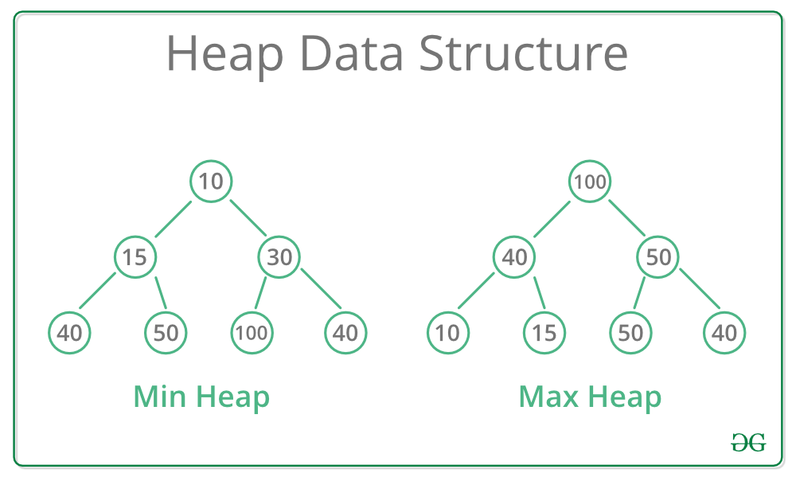

# ADT Priority Queue

- v prioritetni ali prednostni vrsti ima vsak element oznako prioritete, ki doloca vrstni red brisanja elementov iz vrste
- ne velja FIFO (first-in-first-out)

## Osnovne operacije

- `makenull(Q)`: napravi prazno prioritento vrsto Q
- `insert(x, Q)`: vstavi element x v prioritetno vrsto Q
- `deletemin(Q)`: vrne element z najmanso prioriteto iz prioriretne vrste Q in ga zbrise iz Q
- `empty(Q)`: ali je prioritetna vrsta Q prazna

## Ucinkovitost razlicnih implementacij prioritetne vrste

| Implementacija  | `makenull` | `empty` | `insert`          | `deletemin`       |
| --------------- | ---------- | ------- | ----------------- | ----------------- |
| neurejen seznam | $O(1)$     | $O(1)$  | $O(1)$            | $O(n)$            |
| urejen seznam   | $O(1)$     | $O(1)$  | $\leq O(n)$       | $O(1)$            |
| BST             | $O(1)$     | $O(1)$  | $\leq O(n)$       | $\leq O(\log(n))$ |
| AVL, RB-tree    | $O(1)$     | $O(1)$  | =$O(\log(n))$     | =$O(\log(n))$     |
| kopica          | $O(1)$     | $O(1)$  | $\leq O(\log(n))$ | $\leq O(\log(n))$ |

> Najbolsa implementacija s kopico.

## Heap (Kopica)

Kopica je **binarno drevo** z lastnostmi:

1. je **levo poravnano**
   - na najglobljem nivoju drevesa eventualno manjkajo elementi samo z desne strani
1. je **delno urejeno**
   - za vsako poddrevo velja, da je v korenu najmanjsi/najvecji element tega poddrevesa
   - glede na urejenost poznamo `min heap` ter `max heap`

<p align="center"></p>

### Casovna zahtevnost operacij

| Operacija   | Casovna zahtevnost |
| ----------- | ------------------ |
| `insert`    | $\log(n)$          |
| `deletemin` | $\log(n)$          |

### Vstavljanje

1. Element x dodamo na prvo prosto mesto v polju
1. zamenjujemo x z ocetom, doker ni:
   - oce manjsi od x ali
   - x v korenu drevesa

#### Primer 1

<u>MinHeap</u>, vstavite 10, 28, 5, 81, 18, 3, 30, 85, 15

- `10`
<p align="center"></p>

- `28`
<p align="center"></p>

- `5`
<p align="center"></p>

- `81`
<p align="center"></p>

- `18`
<p align="center"></p>

- `3`
<p align="center"></p>

- `30`
<p align="center"></p>

- `85`
<p align="center"></p>

- `15`
<p align="center"></p>

### DeleteMIN

1. Najmansi element se nahaja v korenu
1. Nadomestimo ga z najbolj desnim elementom x na zadnjem nivoju kopice
1. Zaporedno zamenjujemo x z manjsim od obeh sinov, dokler ni:
   - x manjsi od obeh sinov
   - x list drevesa

#### Primer DeleteMIN: Triktrat odstranite najmansi element

<p align="center"></p>

- `deleteMin`
<p align="center"></p>

- `deleteMin`
<p align="center"></p>

- `deleteMin`
<p align="center"></p>

### Decreasekey (fibonacciHeap implementation)

> Ce zelimo ucinkovito decreasekey implementacijo mora imeti vsak element v kopici se kazalec nanj da ga lahko najdemo v trenutku `fibonacciheap`
> tako dobimo casovno zahtevnost $\log(n)$

`decreasekey(x,k,Q)`: elementu z v kopici zamnsamo kljuc za k

- Primer 23 -> 2

<p align="center"></p>

### Izgradnja kopice

- Kopico z $n$ elementi zgradimo v casu reda:

  - $O(n\cdot\log(n))$, ce n-krat uporabimo `insert`
  - $O(n)$, ce so vsi elementi podani na zacetku
    1. elemente najprej kar v poljubnem vrstnem redu posatvimo v kopico, ki je tako levo poravnana
    2. Kopico urejamo po nivojih od spodaj navzgor

- Primer:
  1. elemente v poljubnem vrstnem redu postavimo v kopico
  1. Urejamo po nivojih (od spodnjega do zgornjega)

<p align="center"></p>

### Implementacija kopice s poljem

- obicajno na indeksu 0 hranimo `maxint` oziroma `minint`

<p align="center"></p>

- ce z i oznacimo indeks vozlisca, potem velja:
  - $2\cdot i$: **indeks levega sina**
  - $2\cdot i + 1$: **indeks desnega sina**
  - $\frac{i}{2}$: **indeks oceta**

#### Implementacija (python)

- Implementacija MinHeap (MaxHeap identicno)

```python
import sys

class MinHeap:

    def __init__(self, maxsize):
        self.maxsize = maxsize
        self.size = 0
        self.Heap = [0]*(self.maxsize + 1)
        self.Heap[0] = -1 * sys.maxsize
        self.FRONT = 1

    # Function to return the position of
    # parent for the node currently
    # at pos
    def parent(self, pos):
        return pos//2

    # Function to return the position of
    # the left child for the node currently
    # at pos
    def leftChild(self, pos):
        return 2 * pos

    # Function to return the position of
    # the right child for the node currently
    # at pos
    def rightChild(self, pos):
        return (2 * pos) + 1

    # Function that returns true if the passed
    # node is a leaf node
    def isLeaf(self, pos):
        if pos >= (self.size//2) and pos <= self.size:
            return True
        return False

    # Function to swap two nodes of the heap
    def swap(self, fpos, spos):
        self.Heap[fpos], self.Heap[spos] = self.Heap[spos], self.Heap[fpos]

    # Function to heapify the node at pos
    def minHeapify(self, pos):

        # If the node is a non-leaf node and greater
        # than any of its child
        if not self.isLeaf(pos):
            if (self.Heap[pos] > self.Heap[self.leftChild(pos)] or
               self.Heap[pos] > self.Heap[self.rightChild(pos)]):

                # Swap with the left child and heapify
                # the left child
                if self.Heap[self.leftChild(pos)] < self.Heap[self.rightChild(pos)]:
                    self.swap(pos, self.leftChild(pos))
                    self.minHeapify(self.leftChild(pos))

                # Swap with the right child and heapify
                # the right child
                else:
                    self.swap(pos, self.rightChild(pos))
                    self.minHeapify(self.rightChild(pos))

    # Function to insert a node into the heap
    def insert(self, element):
        if self.size >= self.maxsize :
            return
        self.size+= 1
        self.Heap[self.size] = element

        current = self.size

        while self.Heap[current] < self.Heap[self.parent(current)]:
            self.swap(current, self.parent(current))
            current = self.parent(current)

    # Function to print the contents of the heap
    def Print(self):
        for i in range(1, (self.size//2)+1):
            print(" PARENT : "+ str(self.Heap[i])+" LEFT CHILD : "+
                                str(self.Heap[2 * i])+" RIGHT CHILD : "+
                                str(self.Heap[2 * i + 1]))

    # Function to build the min heap using
    # the minHeapify function
    def minHeap(self):

        for pos in range(self.size//2, 0, -1):
            self.minHeapify(pos)

    # Function to remove and return the minimum
    # element from the heap
    def remove(self):

        popped = self.Heap[self.FRONT]
        self.Heap[self.FRONT] = self.Heap[self.size]
        self.size-= 1
        self.minHeapify(self.FRONT)
        return popped

if __name__ == "__main__":

    print('The minHeap is ')
    minHeap = MinHeap(15)
    minHeap.insert(5)
    minHeap.insert(3)
    minHeap.insert(17)
    minHeap.insert(10)
    minHeap.insert(84)
    minHeap.insert(19)
    minHeap.insert(6)
    minHeap.insert(22)
    minHeap.insert(9)
    minHeap.minHeap()

    minHeap.Print()
    print("The Min val is " + str(minHeap.remove()))
```

#### Implementation of fibonacciHeap (decreaseKey)

- fibonacciHeap: [fibonacciHeap](https://www.programiz.com/dsa/fibonacci-heap)

```java
 /***********************************************************************
 * File: FibonacciHeap.java
 * Author: Keith Schwarz (htiek@cs.stanford.edu)
 *
 * An implementation of a priority queue backed by a Fibonacci heap,
 * as described by Fredman and Tarjan.  Fibonacci heaps are interesting
 * theoretically because they have asymptotically good runtime guarantees
 * for many operations.  In particular, insert, peek, and decrease-key all
 * run in amortized O(1) time.  dequeueMin and delete each run in amortized
 * O(lg n) time.  This allows algorithms that rely heavily on decrease-key
 * to gain significant performance boosts.  For example, Dijkstra's algorithm
 * for single-source shortest paths can be shown to run in O(m + n lg n) using
 * a Fibonacci heap, compared to O(m lg n) using a standard binary or binomial
 * heap.
 *
 * Internally, a Fibonacci heap is represented as a circular, doubly-linked
 * list of trees obeying the min-heap property.  Each node stores pointers
 * to its parent (if any) and some arbitrary child.  Additionally, every
 * node stores its degree (the number of children it has) and whether it
 * is a "marked" node.  Finally, each Fibonacci heap stores a pointer to
 * the tree with the minimum value.
 *
 * To insert a node into a Fibonacci heap, a singleton tree is created and
 * merged into the rest of the trees.  The merge operation works by simply
 * splicing together the doubly-linked lists of the two trees, then updating
 * the min pointer to be the smaller of the minima of the two heaps.  Peeking
 * at the smallest element can therefore be accomplished by just looking at
 * the min element.  All of these operations complete in O(1) time.
 *
 * The tricky operations are dequeueMin and decreaseKey.  dequeueMin works
 * by removing the root of the tree containing the smallest element, then
 * merging its children with the topmost roots.  Then, the roots are scanned
 * and merged so that there is only one tree of each degree in the root list.
 * This works by maintaining a dynamic array of trees, each initially null,
 * pointing to the roots of trees of each dimension.  The list is then scanned
 * and this array is populated.  Whenever a conflict is discovered, the
 * appropriate trees are merged together until no more conflicts exist.  The
 * resulting trees are then put into the root list.  A clever analysis using
 * the potential method can be used to show that the amortized cost of this
 * operation is O(lg n), see "Introduction to Algorithms, Second Edition" by
 * Cormen, Rivest, Leiserson, and Stein for more details.
 *
 * The other hard operation is decreaseKey, which works as follows.  First, we
 * update the key of the node to be the new value.  If this leaves the node
 * smaller than its parent, we're done.  Otherwise, we cut the node from its
 * parent, add it as a root, and then mark its parent.  If the parent was
 * already marked, we cut that node as well, recursively mark its parent,
 * and continue this process.  This can be shown to run in O(1) amortized time
 * using yet another clever potential function.  Finally, given this function,
 * we can implement delete by decreasing a key to -\infty, then calling
 * dequeueMin to extract it.
 */

import java.util.*; // For ArrayList

/**
 * A class representing a Fibonacci heap.
 *
 * @param T The type of elements to store in the heap.
 * @author Keith Schwarz (htiek@cs.stanford.edu)
 */
public final class FibonacciHeap<T> {
    /* In order for all of the Fibonacci heap operations to complete in O(1),
     * clients need to have O(1) access to any element in the heap.  We make
     * this work by having each insertion operation produce a handle to the
     * node in the tree.  In actuality, this handle is the node itself, but
     * we guard against external modification by marking the internal fields
     * private.
     */
    public static final class Entry<T> {
        private int     mDegree = 0;       // Number of children
        private boolean mIsMarked = false; // Whether this node is marked

        private Entry<T> mNext;   // Next and previous elements in the list
        private Entry<T> mPrev;

        private Entry<T> mParent; // Parent in the tree, if any.

        private Entry<T> mChild;  // Child node, if any.

        private T      mElem;     // Element being stored here
        private double mPriority; // Its priority

        /**
         * Returns the element represented by this heap entry.
         *
         * @return The element represented by this heap entry.
         */
        public T getValue() {
            return mElem;
        }
        /**
         * Sets the element associated with this heap entry.
         *
         * @param value The element to associate with this heap entry.
         */
        public void setValue(T value) {
            mElem = value;
        }

        /**
         * Returns the priority of this element.
         *
         * @return The priority of this element.
         */
        public double getPriority() {
            return mPriority;
        }

        /**
         * Constructs a new Entry that holds the given element with the indicated
         * priority.
         *
         * @param elem The element stored in this node.
         * @param priority The priority of this element.
         */
        private Entry(T elem, double priority) {
            mNext = mPrev = this;
            mElem = elem;
            mPriority = priority;
        }
    }

    /* Pointer to the minimum element in the heap. */
    private Entry<T> mMin = null;

    /* Cached size of the heap, so we don't have to recompute this explicitly. */
    private int mSize = 0;

    /**
     * Inserts the specified element into the Fibonacci heap with the specified
     * priority.  Its priority must be a valid double, so you cannot set the
     * priority to NaN.
     *
     * @param value The value to insert.
     * @param priority Its priority, which must be valid.
     * @return An Entry representing that element in the tree.
     */
    public Entry<T> enqueue(T value, double priority) {
        checkPriority(priority);

        /* Create the entry object, which is a circularly-linked list of length
         * one.
         */
        Entry<T> result = new Entry<T>(value, priority);

        /* Merge this singleton list with the tree list. */
        mMin = mergeLists(mMin, result);

        /* Increase the size of the heap; we just added something. */
        ++mSize;

        /* Return the reference to the new element. */
        return result;
    }

    /**
     * Returns an Entry object corresponding to the minimum element of the
     * Fibonacci heap, throwing a NoSuchElementException if the heap is
     * empty.
     *
     * @return The smallest element of the heap.
     * @throws NoSuchElementException If the heap is empty.
     */
    public Entry<T> min() {
        if (isEmpty())
            throw new NoSuchElementException("Heap is empty.");
        return mMin;
    }

    /**
     * Returns whether the heap is empty.
     *
     * @return Whether the heap is empty.
     */
    public boolean isEmpty() {
        return mMin == null;
    }

    /**
     * Returns the number of elements in the heap.
     *
     * @return The number of elements in the heap.
     */
    public int size() {
        return mSize;
    }

    /**
     * Given two Fibonacci heaps, returns a new Fibonacci heap that contains
     * all of the elements of the two heaps.  Each of the input heaps is
     * destructively modified by having all its elements removed.  You can
     * continue to use those heaps, but be aware that they will be empty
     * after this call completes.
     *
     * @param one The first Fibonacci heap to merge.
     * @param two The second Fibonacci heap to merge.
     * @return A new FibonacciHeap containing all of the elements of both
     *         heaps.
     */
    public static <T> FibonacciHeap<T> merge(FibonacciHeap<T> one, FibonacciHeap<T> two) {
        /* Create a new FibonacciHeap to hold the result. */
        FibonacciHeap<T> result = new FibonacciHeap<T>();

        /* Merge the two Fibonacci heap root lists together.  This helper function
         * also computes the min of the two lists, so we can store the result in
         * the mMin field of the new heap.
         */
        result.mMin = mergeLists(one.mMin, two.mMin);

        /* The size of the new heap is the sum of the sizes of the input heaps. */
        result.mSize = one.mSize + two.mSize;

        /* Clear the old heaps. */
        one.mSize = two.mSize = 0;
        one.mMin  = null;
        two.mMin  = null;

        /* Return the newly-merged heap. */
        return result;
    }

    /**
     * Dequeues and returns the minimum element of the Fibonacci heap.  If the
     * heap is empty, this throws a NoSuchElementException.
     *
     * @return The smallest element of the Fibonacci heap.
     * @throws NoSuchElementException If the heap is empty.
     */
    public Entry<T> dequeueMin() {
        /* Check for whether we're empty. */
        if (isEmpty())
            throw new NoSuchElementException("Heap is empty.");

        /* Otherwise, we're about to lose an element, so decrement the number of
         * entries in this heap.
         */
        --mSize;

        /* Grab the minimum element so we know what to return. */
        Entry<T> minElem = mMin;

        /* Now, we need to get rid of this element from the list of roots.  There
         * are two cases to consider.  First, if this is the only element in the
         * list of roots, we set the list of roots to be null by clearing mMin.
         * Otherwise, if it's not null, then we write the elements next to the
         * min element around the min element to remove it, then arbitrarily
         * reassign the min.
         */
        if (mMin.mNext == mMin) { // Case one
            mMin = null;
        }
        else { // Case two
            mMin.mPrev.mNext = mMin.mNext;
            mMin.mNext.mPrev = mMin.mPrev;
            mMin = mMin.mNext; // Arbitrary element of the root list.
        }

        /* Next, clear the parent fields of all of the min element's children,
         * since they're about to become roots.  Because the elements are
         * stored in a circular list, the traversal is a bit complex.
         */
        if (minElem.mChild != null) {
            /* Keep track of the first visited node. */
            Entry<?> curr = minElem.mChild;
            do {
                curr.mParent = null;

                /* Walk to the next node, then stop if this is the node we
                 * started at.
                 */
                curr = curr.mNext;
            } while (curr != minElem.mChild);
        }

        /* Next, splice the children of the root node into the topmost list,
         * then set mMin to point somewhere in that list.
         */
        mMin = mergeLists(mMin, minElem.mChild);

        /* If there are no entries left, we're done. */
        if (mMin == null) return minElem;

        /* Next, we need to coalsce all of the roots so that there is only one
         * tree of each degree.  To track trees of each size, we allocate an
         * ArrayList where the entry at position i is either null or the
         * unique tree of degree i.
         */
        List<Entry<T>> treeTable = new ArrayList<Entry<T>>();

        /* We need to traverse the entire list, but since we're going to be
         * messing around with it we have to be careful not to break our
         * traversal order mid-stream.  One major challenge is how to detect
         * whether we're visiting the same node twice.  To do this, we'll
         * spent a bit of overhead adding all of the nodes to a list, and
         * then will visit each element of this list in order.
         */
        List<Entry<T>> toVisit = new ArrayList<Entry<T>>();

        /* To add everything, we'll iterate across the elements until we
         * find the first element twice.  We check this by looping while the
         * list is empty or while the current element isn't the first element
         * of that list.
         */
        for (Entry<T> curr = mMin; toVisit.isEmpty() || toVisit.get(0) != curr; curr = curr.mNext)
            toVisit.add(curr);

        /* Traverse this list and perform the appropriate unioning steps. */
        for (Entry<T> curr: toVisit) {
            /* Keep merging until a match arises. */
            while (true) {
                /* Ensure that the list is long enough to hold an element of this
                 * degree.
                 */
                while (curr.mDegree >= treeTable.size())
                    treeTable.add(null);

                /* If nothing's here, we're can record that this tree has this size
                 * and are done processing.
                 */
                if (treeTable.get(curr.mDegree) == null) {
                    treeTable.set(curr.mDegree, curr);
                    break;
                }

                /* Otherwise, merge with what's there. */
                Entry<T> other = treeTable.get(curr.mDegree);
                treeTable.set(curr.mDegree, null); // Clear the slot

                /* Determine which of the two trees has the smaller root, storing
                 * the two tree accordingly.
                 */
                Entry<T> min = (other.mPriority < curr.mPriority)? other : curr;
                Entry<T> max = (other.mPriority < curr.mPriority)? curr  : other;

                /* Break max out of the root list, then merge it into min's child
                 * list.
                 */
                max.mNext.mPrev = max.mPrev;
                max.mPrev.mNext = max.mNext;

                /* Make it a singleton so that we can merge it. */
                max.mNext = max.mPrev = max;
                min.mChild = mergeLists(min.mChild, max);

                /* Reparent max appropriately. */
                max.mParent = min;

                /* Clear max's mark, since it can now lose another child. */
                max.mIsMarked = false;

                /* Increase min's degree; it now has another child. */
                ++min.mDegree;

                /* Continue merging this tree. */
                curr = min;
            }

            /* Update the global min based on this node.  Note that we compare
             * for <= instead of < here.  That's because if we just did a
             * reparent operation that merged two different trees of equal
             * priority, we need to make sure that the min pointer points to
             * the root-level one.
             */
            if (curr.mPriority <= mMin.mPriority) mMin = curr;
        }
        return minElem;
    }

    /**
     * Decreases the key of the specified element to the new priority.  If the
     * new priority is greater than the old priority, this function throws an
     * IllegalArgumentException.  The new priority must be a finite double,
     * so you cannot set the priority to be NaN, or +/- infinity.  Doing
     * so also throws an IllegalArgumentException.
     *
     * It is assumed that the entry belongs in this heap.  For efficiency
     * reasons, this is not checked at runtime.
     *
     * @param entry The element whose priority should be decreased.
     * @param newPriority The new priority to associate with this entry.
     * @throws IllegalArgumentException If the new priority exceeds the old
     *         priority, or if the argument is not a finite double.
     */
    public void decreaseKey(Entry<T> entry, double newPriority) {
        checkPriority(newPriority);
        if (newPriority > entry.mPriority)
            throw new IllegalArgumentException("New priority exceeds old.");

        /* Forward this to a helper function. */
        decreaseKeyUnchecked(entry, newPriority);
    }

    /**
     * Deletes this Entry from the Fibonacci heap that contains it.
     *
     * It is assumed that the entry belongs in this heap.  For efficiency
     * reasons, this is not checked at runtime.
     *
     * @param entry The entry to delete.
     */
    public void delete(Entry<T> entry) {
        /* Use decreaseKey to drop the entry's key to -infinity.  This will
         * guarantee that the node is cut and set to the global minimum.
         */
        decreaseKeyUnchecked(entry, Double.NEGATIVE_INFINITY);

        /* Call dequeueMin to remove it. */
        dequeueMin();
    }

    /**
     * Utility function which, given a user-specified priority, checks whether
     * it's a valid double and throws an IllegalArgumentException otherwise.
     *
     * @param priority The user's specified priority.
     * @throws IllegalArgumentException If it is not valid.
     */
    private void checkPriority(double priority) {
        if (Double.isNaN(priority))
            throw new IllegalArgumentException(priority + " is invalid.");
    }

    /**
     * Utility function which, given two pointers into disjoint circularly-
     * linked lists, merges the two lists together into one circularly-linked
     * list in O(1) time.  Because the lists may be empty, the return value
     * is the only pointer that's guaranteed to be to an element of the
     * resulting list.
     *
     * This function assumes that one and two are the minimum elements of the
     * lists they are in, and returns a pointer to whichever is smaller.  If
     * this condition does not hold, the return value is some arbitrary pointer
     * into the doubly-linked list.
     *
     * @param one A pointer into one of the two linked lists.
     * @param two A pointer into the other of the two linked lists.
     * @return A pointer to the smallest element of the resulting list.
     */
    private static <T> Entry<T> mergeLists(Entry<T> one, Entry<T> two) {
        /* There are four cases depending on whether the lists are null or not.
         * We consider each separately.
         */
        if (one == null && two == null) { // Both null, resulting list is null.
            return null;
        }
        else if (one != null && two == null) { // Two is null, result is one.
            return one;
        }
        else if (one == null && two != null) { // One is null, result is two.
            return two;
        }
        else { // Both non-null; actually do the splice.
            /* This is actually not as easy as it seems.  The idea is that we'll
             * have two lists that look like this:
             *
             * +----+     +----+     +----+
             * |    |--N->|one |--N->|    |
             * |    |<-P--|    |<-P--|    |
             * +----+     +----+     +----+
             *
             *
             * +----+     +----+     +----+
             * |    |--N->|two |--N->|    |
             * |    |<-P--|    |<-P--|    |
             * +----+     +----+     +----+
             *
             * And we want to relink everything to get
             *
             * +----+     +----+     +----+---+
             * |    |--N->|one |     |    |   |
             * |    |<-P--|    |     |    |<+ |
             * +----+     +----+<-\  +----+ | |
             *                  \  P        | |
             *                   N  \       N |
             * +----+     +----+  \->+----+ | |
             * |    |--N->|two |     |    | | |
             * |    |<-P--|    |     |    | | P
             * +----+     +----+     +----+ | |
             *              ^ |             | |
             *              | +-------------+ |
             *              +-----------------+
             *
             */
            Entry<T> oneNext = one.mNext; // Cache this since we're about to overwrite it.
            one.mNext = two.mNext;
            one.mNext.mPrev = one;
            two.mNext = oneNext;
            two.mNext.mPrev = two;

            /* Return a pointer to whichever's smaller. */
            return one.mPriority < two.mPriority? one : two;
        }
    }

    /**
     * Decreases the key of a node in the tree without doing any checking to ensure
     * that the new priority is valid.
     *
     * @param entry The node whose key should be decreased.
     * @param priority The node's new priority.
     */
    private void decreaseKeyUnchecked(Entry<T> entry, double priority) {
        /* First, change the node's priority. */
        entry.mPriority = priority;

        /* If the node no longer has a higher priority than its parent, cut it.
         * Note that this also means that if we try to run a delete operation
         * that decreases the key to -infinity, it's guaranteed to cut the node
         * from its parent.
         */
        if (entry.mParent != null && entry.mPriority <= entry.mParent.mPriority)
            cutNode(entry);

        /* If our new value is the new min, mark it as such.  Note that if we
         * ended up decreasing the key in a way that ties the current minimum
         * priority, this will change the min accordingly.
         */
        if (entry.mPriority <= mMin.mPriority)
            mMin = entry;
    }

    /**
     * Cuts a node from its parent.  If the parent was already marked, recursively
     * cuts that node from its parent as well.
     *
     * @param entry The node to cut from its parent.
     */
    private void cutNode(Entry<T> entry) {
        /* Begin by clearing the node's mark, since we just cut it. */
        entry.mIsMarked = false;

        /* Base case: If the node has no parent, we're done. */
        if (entry.mParent == null) return;

        /* Rewire the node's siblings around it, if it has any siblings. */
        if (entry.mNext != entry) { // Has siblings
            entry.mNext.mPrev = entry.mPrev;
            entry.mPrev.mNext = entry.mNext;
        }

        /* If the node is the one identified by its parent as its child,
         * we need to rewrite that pointer to point to some arbitrary other
         * child.
         */
        if (entry.mParent.mChild == entry) {
            /* If there are any other children, pick one of them arbitrarily. */
            if (entry.mNext != entry) {
                entry.mParent.mChild = entry.mNext;
            }
            /* Otherwise, there aren't any children left and we should clear the
             * pointer and drop the node's degree.
             */
            else {
                entry.mParent.mChild = null;
            }
        }

        /* Decrease the degree of the parent, since it just lost a child. */
        --entry.mParent.mDegree;

        /* Splice this tree into the root list by converting it to a singleton
         * and invoking the merge subroutine.
         */
        entry.mPrev = entry.mNext = entry;
        mMin = mergeLists(mMin, entry);

        /* Mark the parent and recursively cut it if it's already been
         * marked.
         */
        if (entry.mParent.mIsMarked)
            cutNode(entry.mParent);
        else
            entry.mParent.mIsMarked = true;

        /* Clear the relocated node's parent; it's now a root. */
        entry.mParent = null;
    }
}
```
