# ADT drevo

## Operacije

Operacije definirane za `ADT TREE`:

- `create(r, v, T1, ..., Ti)` - generira drevo s korenom r z oznako v ter s stopnjo i s podddrevesi T1, ..., Ti
- `makenull(T)` - naredi prazno drevo T
- `root(T)` - vrne koren drevesa T
- `parent(n, T)` - vrne ocenta vozlisca n v drevesu T
- `leftmost_child(n, T)` - vrne najbolj levega sina vozlsica n
- `right_sibling(n, T)` - vrne desnega brata vozlisca n
- `label(n, T)` - vrne oznako vozlisca n

### Primer visina drevesa

- `right_sibling` in `leftmost_child` omogocata dostop do levega otroka in desnega brata
- rekurzija gre lahko v te dve smeri
- Robni primer: prazno poddrevo

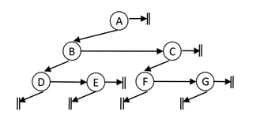</p>

```java
// Splosno drevo
public int height(Node root) {
    if (root == null)
        return 0;
    return Math.max(height(root.leftmostChild+1),
                    height(root.rightSibling));
}
```

> Casovna zahtevnost zgornjega algoritma: $O(n)$

### Obhod drevesa

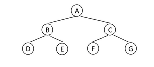

```java
Node root = new Node(
    new Node(new Node("D"), new Node("E"), "B"),
    new Node(new Node("F"), new Node("G"), "C"),
    "A"
);
```

Obhod (traversal) na vec nacinov (zgled binary tree):

- `premi (preorder)`: izpisemo oznako korena pred oznakami poddreves

```java
public static void preorder(Node root) {
    if (root != null) {
        System.out.printf("%s ", root.value);
        preorder(root.left);
        preorder(root.right);
    }
} // A B D E C F G
```

- `obratni (postorder)`: izpisemo najprej oznake vozlisc vseh poddreves in zatem oznako korena

```java
public static void postorder(Node root) {
    if (root != null) {
        postorder(root.left);
        postorder(root.right);
        System.out.printf("%s ", root.value);
    }
} // D E B F G C A
```

- `vmesni (inorder)`: izpisemo najprej oznake vozlisc najbolj levega poddrevesa, zatem oznako korena in zatem oznake vozlisc vseh ostalih podddrevs

```java
public static void inorder(Node root) {
    if (root != null) {
        inorder(root.left);
        System.out.printf("%s ", root.value);
        inorder(root.right);
    }
} // D B E A F C G
```

- `nivojski`: izpisemo najprej vsa vozlisca na 1. nivoju, zatem na 2. nivoju in tako naprej

```java
public static void breadthFirst(Node root) {
    Queue<Node> queue = new LinkedList<>();
    queue.add(root);
    while (!queue.isEmpty()) {
        Node cur = queue.poll();
        System.out.printf("%s ", cur.value);
        if (cur.left != null)
            queue.add(cur.left);
        if (cur.right != null)
            queue.add(cur.right);
    }
} // A B C D E F G
```

## Implementacija drevesa

- s `poljem`
- s `kazalci`

### Implementacija drevesa s poljem

Drevo je shranjeno v polje na naslednji nacin:

- vsako vozlisce hrani stevilo sinov, celo drevo pa stevilo vozlisc n
- koren drevesa je prvi element polja
- sledijo vsa vozlisca prvega (najbolj leevega) podrevesa, nato vsa ostala vozlisca drugega poddrevesa in naprej

<p align="center">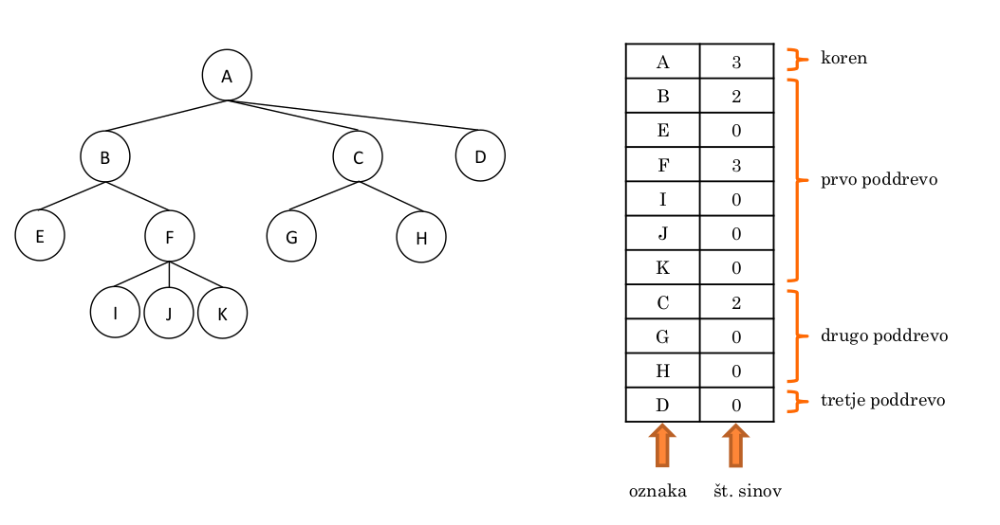</p>

Ker polje ni dinamicna podatkovna struktura, se redko uporablja za implementacijo dreves.

- Problematicno je **spreminjanje dreves**
- Casovne zahtevnosti:

<p align="center">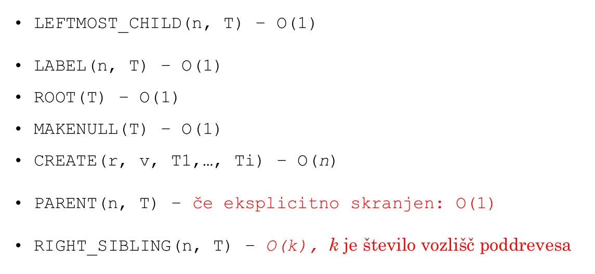</p>

Za `levo poravnana drevesa s konstantno stopnjo` so operacije sprehajanja po drevesu ucinkovite (razen operacije `create`)

<p align="center">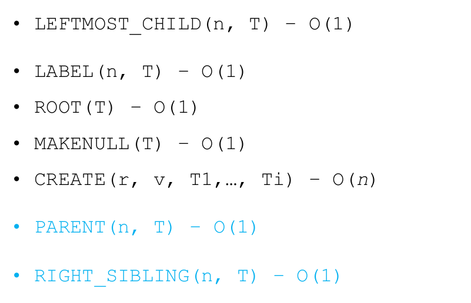</p>

<p align="center">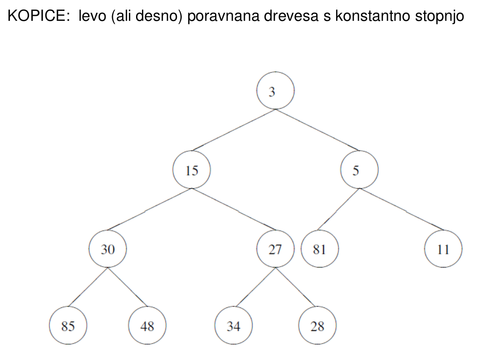</p>

### Implementacija drevesa s kazalci

Imamo dve osnovni obliki:

- vsako vozlisce vsebuje `kazalci na levega otroka in desnega brata`
<p align="center">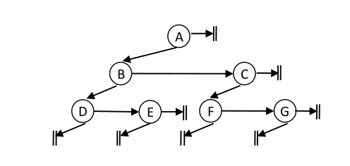</p>

- vsako vozlisce vsebuje `kazalce na vse otroke`
<p align="center">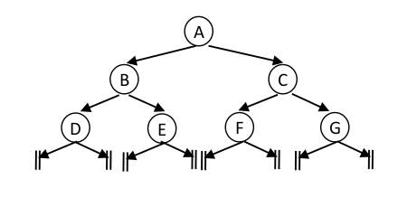</p>

#### Kazalec na desnega brata in levega sina

Casovne zahtevnosti operacij

- operacije so ucinkovite

<p align="center">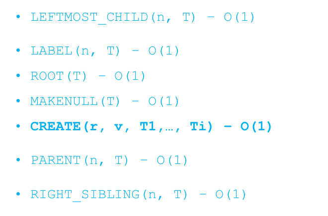</p>

## Binarna drevesa

- Vsa vozlisca s stopnjo manjso ali enako 2
- Vozlisce ima lahko tudi samo desnega sina

Lastnosti binarnih dreves:

- binarno drevo visine v ima najvec $2^v-1$ vozlisc
- visina binarnega drevesa z n vozlisci: $n\geq v \geq \lceil{\log_2(n+1)}\rceil$
- v ibinarnem drevesu z n vozlisci je n+1 praznih poddreves

> Na koliko nacinov lahko izrodimo binarno drevo z n vozlisci?

> $2^{(n-1)}$: pri vsakem vozliscu imamo dve moznosti da izberemo eno vozlisce (razen prvo vozlisce smo fiksirali)

## Izrazna drevesa

- tisti ki operatorji ki vezejo najmocneje: najnizje v drevesu

<p align="center">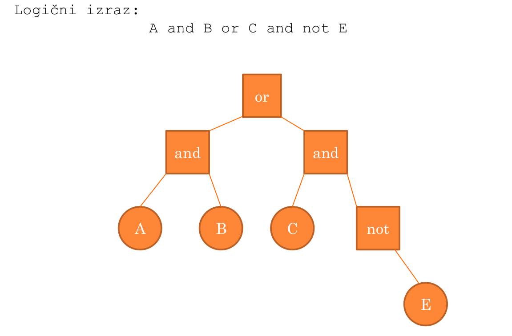</p>

- oklepaji spremenijo priorirteto operandov (najnizje v drevesu)
- levo asociativnost operandov (`*` veze pred `\`)

<p align="center">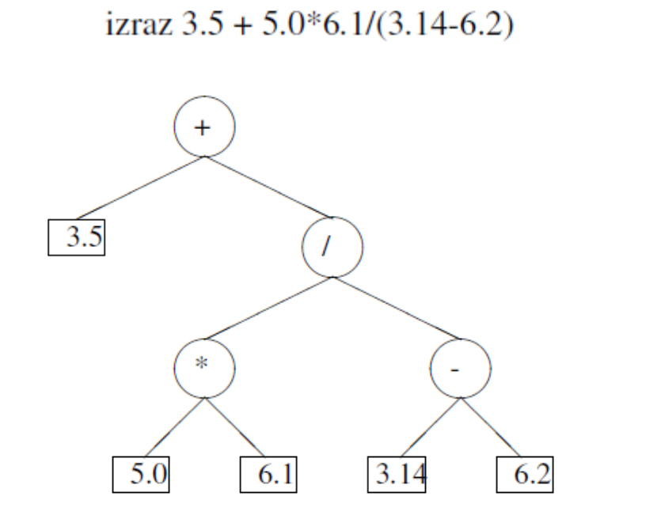</p>

### Implementacija izraznih dreves

<p align="center">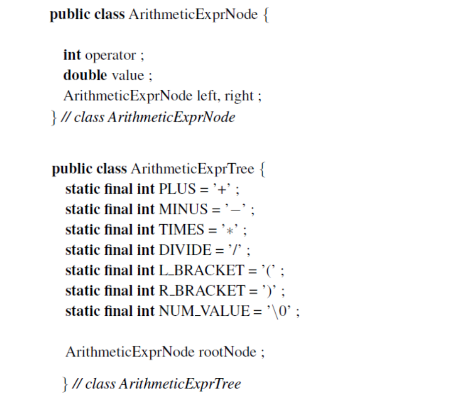</p>

<p align="center">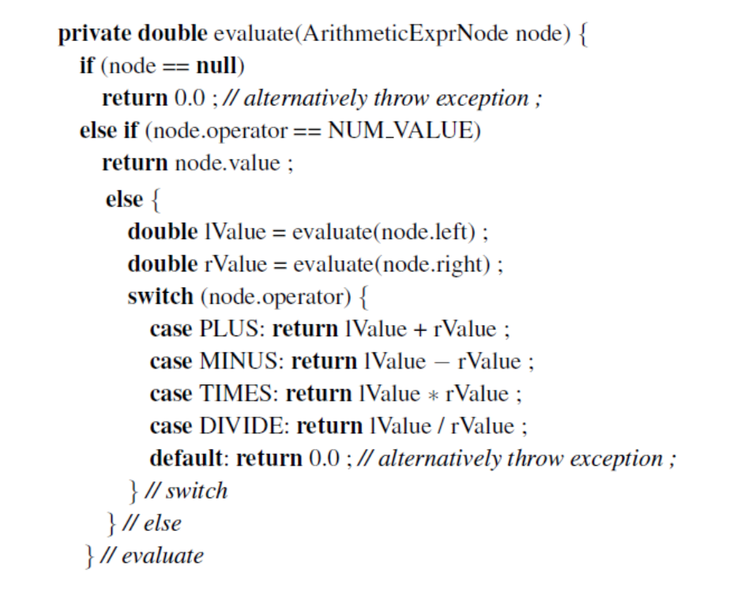</p>

- Casovna zahtevnost: $O(1)$ - vsako vozlisce obiskano samo enkrat

- Primer izracun izraza

<p align="center">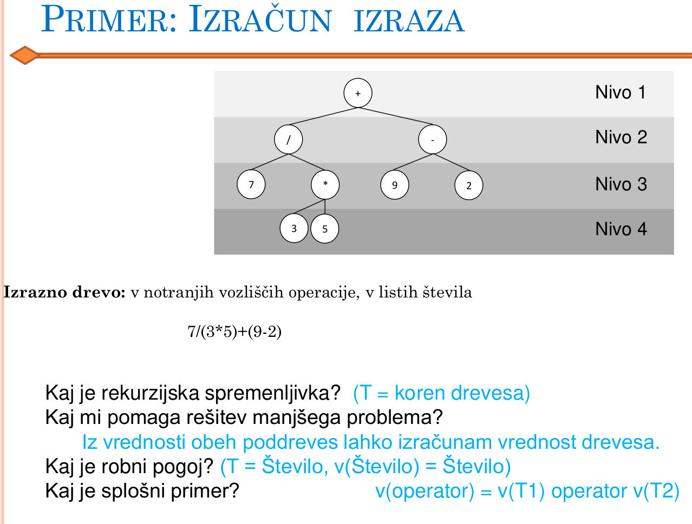</p>

### Gradnja izraznih dreves

Iz danega izraza na vhodu zelimo zgraditi izrazno drevo

1. Sintakticna analiza vhoda
2. Gradnja drevesa

#### Sintakticna analiza

Sintakticna analiza:

- poznati moramo strukturo vseh moznih izrazov
  - Leva asociativnost: a+b+c=(a+b)+c
  - Vezava (prioriteta) operatorjev: $a+b\cdot c= a+(b\cdot c)$

<p align="center">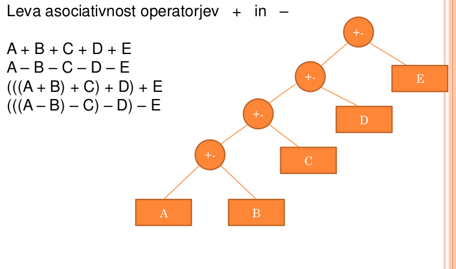</p>

<p align="center">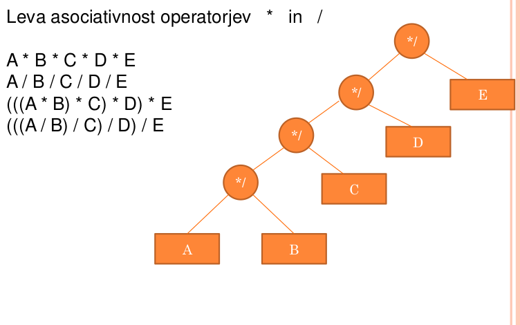</p>

#### Kontekstno neodvisno gramatike

Pomagamo si s kontektsno neodvisno gramtiko, ki opisuje vse mozne aritmeticne izraze.

Gramaticno pravilo
$<x>::=blabla$ pomeni, da lahko pri generiranju izaraza spremnljivko $<x>$ zamenjamo z izrazom $blabla$

<p align="center">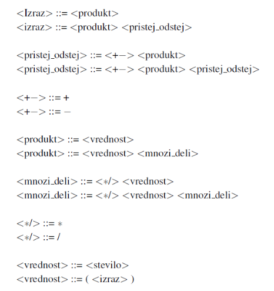</p>

#### Princip sintakticne analize

- izraz beremo na vhodu od leve proti desni
- beremo po en simbol naenkrat, ki je lahko (,),+,-,\*, ali stevilo
- za vsako srepemnljivko uvedeno eno metodo (razen za trivialne)
- vsaka metoda na zacetku dobi prvi prebrani simbol in na koncu vrne en (prebrani) simbol, ki je prvi simbol za naslednjo metodo

<p align="center">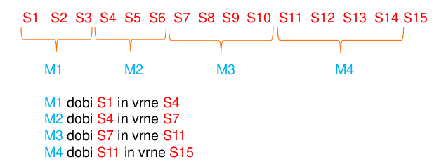</p>

<p align="center">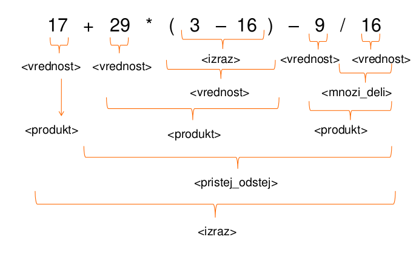</p>

Napisati moramo metode:

- `<izraz>`: expression
- `<produkt>`: product
- `<pristej_odstej>`: addSubtract
- `<vrednost>`: value
- `<mnozi_deli>`: multiplyDivide

V javi lahko uporabimo `StringTokenizer`

<p align="center">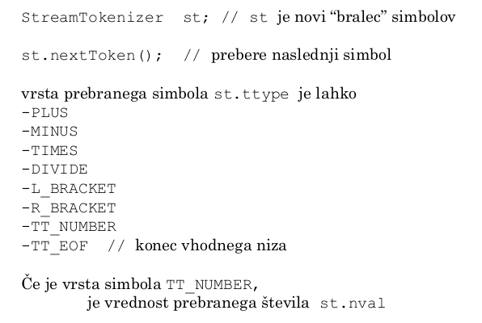</p>

#### Sintakticna analiza + Drevo

Med sintakticno analizo gradimo izrazno drevo.

1. Metoda expression
<p align="center">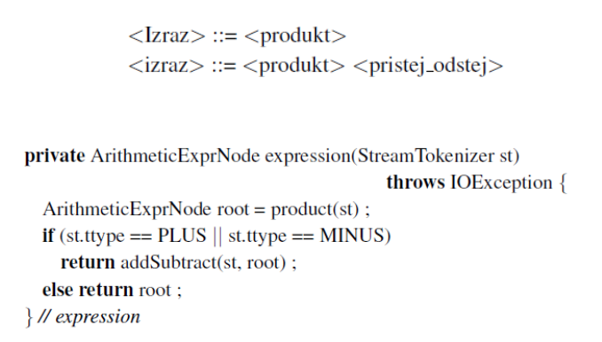</p>

2. Metoda addSubtract

<p align="center">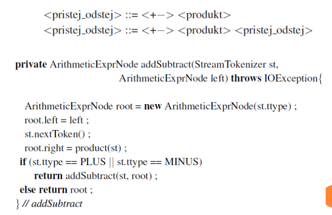</p>

3. Metoda produkt

- zgolj preimenujemo stvari v metodi expression

<p align="center">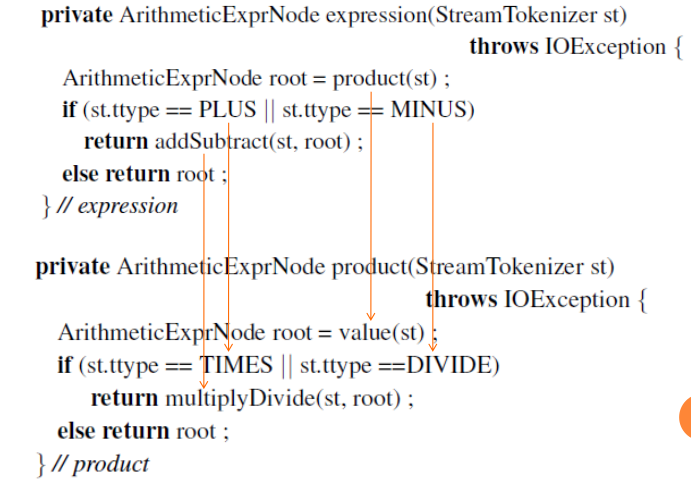</p>

<p align="center">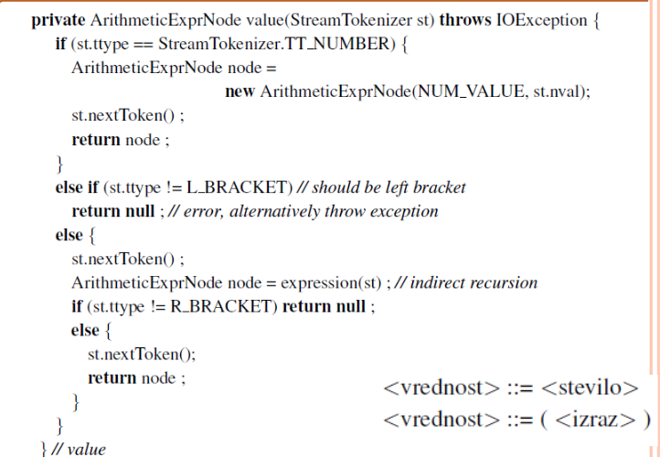</p>

> Casovna zahtevnost sintakticne analize O(n)
