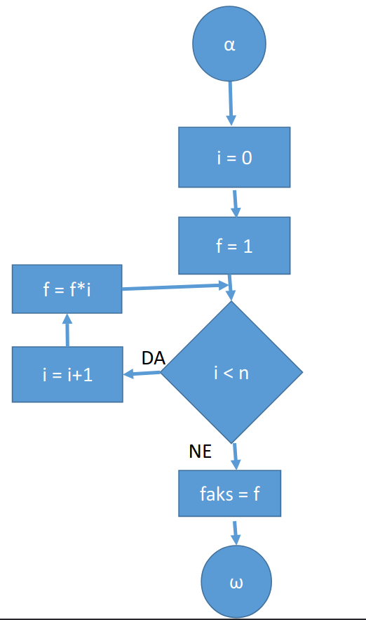

# Dokazovanje pravilnosti programov

`Parcialno pravilen program`: ce v primeru da se za vhodne podatke, ki izpolnjujejo zacetni pogoj program ustavi, izhodni podatki pa izpolnjujejo zakljucni pogoj.

`Totalno pravilen`: ce je parcialno pravilen in ce se za vse vhodne podatke ki izpolnjujejo zacetni pogoj, po koncnem stevilu korakov ustavi.

`Zancna invarianta I(y)`: pogoj, ki je vedno resnicen pred, za in po vsaki iteraciji zanke.

```java
int j = 9;
for (int i = 0; i < 10; i++)
    j--1
// Zancna invarainta i+j == 9
// Sibkejsa zancna invarianta i>= 0 && i <= 10
```

### Parcialna pravilnost programa

- Pri zankah definiramo dovolj mocne zancne invariante
- Uporabljamo pravila izpeljevanja pogojev
- Zacnemo pri zacetku programa z zacetnim pogojem
- Izpeljujemo vse do zakljucka programa, kjer mora biti izpolnjen zakljucni pogoj
- Ce iz zacetnega pogoja izpeljemo zakljucni pogoj, je program parcialno pravilen

### Totalna pravilnost

- je parcialno pravilen
- se za vse vhodne podatke, ki izpolnjujejo zacetni pogoj, po koncanem stevilu korakov ustavi

### Primer1: Izracun faktoriele

- Zacetni pogoj: $\phi (n) = (n\in \N \cup \{0\})$
- Zakljucni pogoj: $\psi(\text{faks}, n)=(\text{faks}=n!)$



```java
static public int faks(int n) {
    // \phi(n)= (n >= 0)
    int i = 0;
    int f = 1;
    // Dolocimo zancna invarianta: f=i!
    // 1 = 0! (vstopna tocka velja)
    while (i < n) {
        /* Zanka
        i < n, i-1 < n --> i <= n, f = (i-1)!
        */
        i++;
        f *= i;
    }
    /* V izstopni tocki zanke velja
    * 1) f = i!
    * 2) i >= n --> i = n
    * 3) i <= n
    * --> f = n!
    */
    return f;
    // \psi(faks, n) = (faks = n!)
    // Torej velja faks = f = n! --> Program je parcialno pravilen
}
```

- Dokazemo se <u>ustavljivost programa</u>
  1. Dobro utemeljena mnozica: $\N \cup \{0\}$
  1. Zancna spremenljivka: $I = n-i$
  1. Zancna invarianta: $n-i \in N$
  1. Velja: Zancna spremenljivka se zmansuje: $II = n-i-1 < I=n-i$

```java
static public int faks(int n) {
    // \phi(n)= (n >= 0)
    int i = 0;
    int f = 1;
    // Dolocimo zancna invariant: n-i!
    // --> n-i \in N
    while (i < n) {
        /* Zanka
        i < n, i-1 < n --> i <= n
        velja: n-i \in N
        */
        i++;
        f *= i;
    }
    /* V izstopni tocki zanke velja
    * 1) f = i!
    * 2) i >= n --> i = n
    * 3) i <= n
    * --> i = n, n-i \in N
    */
    return f;
    // \psi(faks, n) = (faks = n!)
    // Torej velja faks = f = n! --> Program je totalno pravilen
}
```

### 2.Primer: Mnozenje z inkrementom

- potrebovali bomo 2 zancni invarianti

```java
static public int prod(int x, int y) {
    // fi(x, y) = (x,y \in \N \cup {0})
    int i, j, p;
    i=0;
    p=0;
    /* Zunanja zancnna invarianta
    p = i*y (0=0*y)
    */
    while (i != x) {
        j = 0;
        /* Notranja zancna invarianta
        p = i*y + j
        */
        while (j != y) {
            p++;
            j++;
        }
        i++;
        // velja p = i*y
    }
    return p;
    // psi(prod, x, y) = (prod = x * y)
}
```

- Ustavljivost programa:
  1. Dobro utemeljena mnozica: $\N \cup \{0\}$
  1. Zancna spremenljivka 1: $I1 = y-j$
  1. Zancna invarianta 1: $y-j\in \N$
  1. Zancna spremenljivka 2: $I2 = x-i$
  1. Zancna invarianta 2: $x-i\in \N$
  1. Vrednost $I1$ in $I2$ se zmansujeta:
     - $II1= y-j-1 < I1$
     - $II2= x-i-1 < I2$

### 3.Primer: Iskanje maksimalnega stevila

```java
static public double max(double x[], int n) {
    // fi(x,n) = (n>0) & (x[i] pripada R, i = 1...n)
    int i = 1; // i = 1
    double m = x[i]; // m = x[i]
    // Zancna varianta: m = max(x[k]) , k =1...i (velja)
    while (i != n) {
        // i !=n -> i < n in m max(x[k]), k = 1...i
        i++;
        if (x[i] > m)
            m = x[i];
    }
    // !(i != n) --> i == n
    // m = max(x[k]) (k = 1...i = 1...n)
    return m; // max = m
    // psi(x, n, max) = (max = max x[i])
}
```

- Treba je dokazati se ustavljivost programa:
  1. Dobro utemeljena mnozica: N (z 0)
  1. Zancna spremenljivka $I = n-i$
  1. Zancna invarianta: $n-i\in\N$
  1. Vrednost I se zmansuje: $II= n-i-1 < I=n-i$
