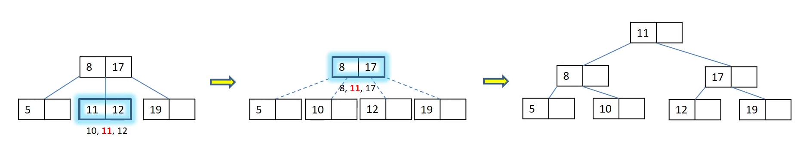

Vrste iskalnih dreves

- `binarna iskalna drevesa (binary search trees)`
- `lomljena drevesa (splay trees)`
- `rdece-crna drevesa (red-black trees)`
- `AVL-drevesa`
- `2-3 drevesa`
- `B-drevesa`
- `K-d drevesa`

# 1. Binary Search Tree

Binarno iskalno drevo (BST) je najbolj preprosta drevesna implementacija slovarja.

Rekuzivna definicija:

- prazno drevo je BST
- drevo z oznako (kljucem) korena x z levim in desnim poddrevesom L in R je BST, ce velja:
  - $\forall y \in L: y<x \land \forall y \in R: y> x$
  - in sta tudi L in R BST

## Implementacija

Drevo je podano kot referenca na vozliscu v korenu:

## Osnovne operacije

| Operacija           | Casovna zahtevnost pri poravnanem dreveseu | pri izrojenem |
| ------------------- | ------------------------------------------ | ------------- |
| `iskanje elementa`  | $O(\log(n))$                               | $O(n)$        |
| `dodajanje lista`   | $O(\log(n))$                               | $O(n)$        |
| `dodajanje korena`  | $O(\log(n))$                               | $O(n)$        |
| `rotacija`          | $O(1)$                                     | $O(1)$        |
| `brisanje elementa` | $O(\log(n))$                               | $O(n)$        |

### Rotacija elementov

### Iskanje elementa v BST

### Brisanje elmenta

- bodisi poiscemo najmansega v desnem poddrevesu, bodisi najvecjega v levem poddrevesu

### Dodajanje elementa

#### V list drevesa

#### V koren drevesa

- Element vstavimo kot list
- Nato uporabljam leve ter desne rotacije da ga dvigujem proti korenu

##### Primer

Vstavite v koren BST: 8, 5, 19, 12, 17

- `8`

- `5`

- `19`

- `12`

- `17`

# 2. Splay tree

- Pri vsaki operaciji se drevo spremeni - se lomi
- Uporablja dvojne rotacije za dvig elementa v koren - lomljenje

Pri **iskanju** se najdeni element (ali oce praznega lista, ce elementa ni v drevesu) z lomljenjem dvigne v koren

Pri **vstavljanju**: selement vstavi kot list in ga z lomljenjem dvigne koren

Pri **brisanju**: element najprej z lomljenjem dvignemo v koren, zatem z lomjenjem dvignemo najmansi element v desnem poddrevesu, ki nadomesti izbrisani element v koreno

> Na dolgi rok drenvo ne more ostati izrojeno - v povprecju so vse operacije ucinkovite $O(\log(n))$

## Dvojne rotacije

- Uporablja dvojne rotacije.

# 3. Red-black tree

Binarno iskalno drevo za katerega velja:

- vsako vzolisce je bodisi **rdece** bodisi **crne** barve
- **rdece** vozlisce ima lahko samo **crna** sinova
- za **vsako** vozlisce velja, da **vsaka pot** od vozlisca do praznega poddrevesa (Null) vsebuje **enako** stevilo **crnih** vozlisc

- **visina** rdece-crnega drevesa z n vozlisci je $\leq 2\log(n+1)$
- Rdece-crno drevo je **vedno delno poravnan**
  - visina drevesa je najvec dvakrat vecja od poravnanega drevesa z istim stevilom vozlisc
  - najdaljsa pot od korena do listov je kvecjemu dvakrat daljse od korena do listov

## Operacije

| Operacija   | Casovna zahtevnost | Worst case    |
| ----------- | ------------------ | ------------- |
| `iskanje`   | $O(\log(n))$       |               |
| `dodajanje` | $O(\log(n))$       | $O(2\log(n))$ |
| `brisanje`  | $O(\log(n))$       | $O(2\log(n))$ |

### Dodajanje

Dodamo **rdeci list**; eventuelno potrebno popravljanje ki se v najslabsem primeru nadaljuje vse do korena -> $O(2\log(n))$

1. Element dodamo v list drevesa kot pri navadnem BST.
1. Dodano vozlisce (list) pobarvamo **rdece**
1. Ce je oce dodanega lista **rdec**, je potrebno drevo popraviti:
   - `D1` oce je koren drevesa -> postopek se zakljuci
       

   - `D2` stric je rdec -> stari oce postane rdec -> rekurzivno ponovi v B (B obravnavamo kot novo dodano vozlisce)
       

   - `D3` stric ni rdec (naprej rotiramo A in B), potem rotiramo (B in C) (ce se dogaja na desni veji zrcalimo)
       

   - `D4` stric ni rdec (ce se dogaja na desni veji zrcalimo)
       

### Primer Dodajanja

Na zacetku je rdece-crno drevo prazno. Narisi drevo po koncanem vstavljanju elementov: **8, 5, 19, 12, 17, 11, 10, 16**

### Brisanje

1. Element zbrisemo iz drevesa kot pri navadnem BST:

   - ce je element list drevesa, ga enostavno zbrisemo
   - ce ima element samo enega sina, ga zbrisemo ter na njegovo mesto postavimo njegovega sina
   - ce ima element dva sina, zbrisemo najvecji element iz levega poddrevesa ali najmanjsi element iz desnega poddrevesa, ki ndaomesti dejansko zbrisano vozlisce

1. Pogledamo kaksne barve je bilo vozlisce ki smo ga zbrisali

   - `2.1` Ce je zbrisano **rdece** vozlisce, koncamo.
   - `2.2` je zbrisano **crno** vozlisce, je potrebno drevo popraviti:
     - `B1` Ce je koren problematicnega poddrevesa **rdec** -> novi koren pobarvaj na crno
        

     - `B2` Ce je zbrisan koren drevesa -> ni nic hudega
        

     - `B3` **crn** brat in **crn** zunanji necak -> **rdec** zunanji necak -> 3.4 (zrcalimo za drugo stran)
        

     - `B4` (zraclimo za drugo stran)
        

     - Ce ne velja nobeno od zgornji
        

### Primer 1

- Iz drevesa odstranite elemente: 8, 10, in 5

### Primer 2

- Iz naslednjega drevesa odstranite elemente: 32, 20, 30, 26, 19

## Implementation

> TODO

# AVL Tree

- **delno poravnano binarno iskalno drevo**
- za vsako vozlisce velja, da se **visini** obeh poddreves razlikujeta **za najvec 1**
- visina maksimalnega izrojenega AVL-drevesa z n elementi je:
  $$h\leq 1.44\log_2(n+1)$$
- stevilo vozlisc izroejenga drevesa: `s(h)=s(h-1)+s(h-2)+1`, s(1) = 0, s(0) = 0

## Primer AVL-drevesa

- v vsakem vozliscu dodamo se **en parameter** (**ravnotezni faktor**: razlika visin desnega in levega poddrevesa)

## Zahtevnost operacij

- zahtevnost osnovnih operacij je **$O(log(n))$**

| Operacija   | Zahtevnost   | Najslabsa (do korena se preracunavajo faktorji) |
| ----------- | ------------ | ----------------------------------------------- |
| `iskanje`   | $O(\log(n))$ | $O(\log(n))$                                    |
| `dodajanje` | $O(\log(n))$ | $O(2\log(n))$                                   |
| `brisanje`  | $O(\log(n))$ | $O(2\log(n))$                                   |

## Dodajanje elementa v AVL-drevo

1. Element dodamo v list drevea kot pri navadnem BST
1. Preverimo ravnotezni faktor vseh vozlisc na poti navzgor od vstavljanega lista do korena drevesa
   - ce je absolutna vrednost ravnoteznega faktorja vecja kot 1, je potrebno drevo popravljati
   - v najslabsem primeru je potrebno popravljati ravnotezni faktor vse do korena - ko pa pride do rotacije (enojne ali dvojne), je postopek zakljucen

### Prva situacija

1. Koren ima absolutno vrednost faktorja 2, sin pa 1 in imata oba faktorja **isti** predznak
1. Izvedemo rotacijo

### Druga situacija

1. Koren ima absolutno vrednost ravnoteznega faktorja 2, sin pa 1 in imata oba faktorja **razlicna** predznaka
1. Izvedemo dvojno rotacijo

### Primer 1

- Na zacetku je AVL-drevo prazno. Narisi drevo po koncanem vstavljaju elementov: 8, 5, 19, 12, 17, 11, 10, 9

### Primer 2

1. Dodamo `22`

2. Dodamo `16`

3. Dodamo `15`

4. Dodamo `14`

## Brisanje elementa

1. Element brisemo iz drevesa kot pri navadnem BST:

   - ce je element list, ga zbrisemo
   - ce ima samo enega sina, ga izbrisemo ter na njegov mesto postavimo sina
   - ce ima dva sina, zbrisemo najvecji element iz levega poddrevesa ali najmansi element iz desnega poddrevsa, ki nadomesti dejansko izbrisano vozlisce

2. Preverimo ravnotezni faktor vseh vozlisc na poti navzgor od oceta dejansko zbrisanega vozlisca do korena vozlisca
   - ce je absolutna vrednost ravnoteznega faktorja vecja kot 1, je potrebno drevo popravljati
   - v najslabsem primeru je potrebno po celi poti od zbrisanega vozlisca do korena poravnati drevo

### Prva situacija

- Ob brisanju elementa iz drevesa brisemo element katerega sin ima ravnotezni faktor enak 0
- Drevo enojno zarotiramo

### Druga situacija

- Koren ima absolutno vrednost ravnoteznega faktorja 2, sin pa 1 in imata oba faktorja **isti** predznak
- Izvedemo enojno rotacijo

### Tretja Situacija

1. Koren ima absolutno vrednost ravnoteznega faktorja 2, sin pa 1 in faktorja imata **razlicna** predznaka
1. Izvedemo dvojno rotacijo

### Primer

- Brisemo `2` iz AVL drevesa

- Brisemo `1` iz AVL drevesa

- Brisemo `22` iz AVL drevesa

- Brisemo `17` iz AVL drevesa

## Implementacija

> TODO

# 2-3 Drevesa

- popolnoma poravnana iskalna drevesa
- vsako vozlisce ima 2 ali 3 sinove in 1 ali 2 kljuca
- 2 vrsti 2-3 dreves:
  1. Vsi elementi se nahajajo v listih: kljuc v notranjem vozliscu je enak najmensemu kljucu v desnem poddrevesu
  1. Elementi se nahajajo v notranjih vozliscih (listi so prazni): kljuc je vecji od vseh v levem in manjsi od vseh v desnem poddrevesu - posp

## Zahtevnost Operacij

1. Vsi elementi se nahajajo v listih: kljuc v notranjem vozliscu je enak najmansemu kljucu v desnem poddrevesu

- $\log(n)$

# B-drevesa

- `B-drevo` je **popolnoma poravnano iskalno drevo** (vsi listi na istem nivoju)
- vsako notranje vozlisce B-drevesa **reda m** ima lahko od $\lceil \frac{m}{2} \rceil$ do m sinov ter en kljuc manj kot ima sinov
  - izjema koren (od 2 do m sinov)

- posplositev binarnih iskalnih dreves (binarno iskalno drevo je B-drevo reda 2)
- vsako B-drevo reda m, ki vsebuje $n\geq 1$ elementov, ima visino najvec:
  $$h\leq \log_{\lceil \frac{m}{2} \rceil}(\frac{n+1}{2})+1$$

> B-drevo je primer iskalnega drevesa, ki je namenjeno optimizaciji stevila dostopov do zunanjega pomnilnika

## Kompleksnost operacij

- Vse operacije so garantirano $O(\log(n))$

| Operacija   | Zahtevnost  | Realna zahtevnost                            |
| ----------- | ----------- | -------------------------------------------- |
| `iskanje`   | $O(\log n)$ | $O(\log m\cdot\log n)=O(\log n)$ (bisekcija) |
| `dodajanje` | $O(\log n)$ |                                              |
| `brisanje`  | $O(\log n)$ |                                              |

## Iskanje

1. Iskanje zacnemo v korenu drevesa
2. Iskani element **zaporedno** primerjamo z elementi v vozliscu, dokler:
   - ne naletimo na iskani element
   - ne naletimo na vecji element in se iskanje rekurzivno nadaljuje v poddrevesu z istim indeksom
   - ne pregledamo zadnjega elementa in se iskanje rekurzivno nadaljuje v zadnjem poddrevesu

- Namesto zaporednega primerjanja Elementa s kljuci v vozliscu, ki vsebuje mnogo (npr 1023) kljucev, uporabimo `bisekcijo`.
- Casovna zahtevnost iskanja z bisekcijo v B-drevesu je $O(\log(m)\cdot\log(n))$
  - $\log(m)$ je konstanta
  - namesto polja bi lahko uporabljali

## Dodajanje v B-drevo

Element dodajamo v ustrezno notranje vozlisce najvecje globine:

1. ce opazovano vozlisce vsebuje mank kot m-1 elementov, dodamo element na ustrezno mesto in koncamo.
1. Ce v opazovanem vozliscu ni prostora (ima ze m-1 elementov in z dodanajem elementa dobimo m elementov), ga razbijemo na dve vozlisci:
   - dolocimo **sredinski** $\lceil m/2 \rceil$ element med m elementi
   - $\lceil m/2 \rceil$-1 elementov, ki so manjsi od sredinskega elementa, damo v novo levo vozlisce
   - m - $\lceil m/2 \rceil$ elementov, ki so vecji od sredinskega elementa, damo v novo desno vozlisce
   - sredinski element rekurzivno dodamo ocetu prejsnega vozlisca

### Primer 1

Na zacetku je B-drevo reda 3 prazno. Narisi drevo po koncanem vstavljanju elementov (8,5,19,12,17,11,10):

- `8`

- `5`

- `19`, vozlisce je polno: ga razbijemo, srednjo vrednost posljemo ocetu

- `12`

- `17`

- `11`

- `10`

### Primer 2

- Na zacetku je B drevo reda 3 prazno. V drevo ddoajte naslednje elemente: 2, 19, 3, 12, 18, 5, 16
- Dodamo `2`

- Dodamo `19`

- Dodamo `3`

- Dodamo `12`

- Dodamo `18`

- Dodamo `5`

- Dodamo `16`

## Brisanje iz B-drevea

### Primer 1

Iz drevesa odstranite elemente 11, 12, 19, 8 in 5

- `11` (rekurzivno pogledamo ce brat lahko sposodi, ce ne posodi oce)

- `12` (brat sposodi lahko)

- `19` (pogledamo ce brat lahko posodi (nemore), nato zdruzimo z bratom, ter vzamemo od oceta kljuc ki je med njima)

- `8`

- `5`

### Primer 2

- Brisemo `5`

- Brisemo `22`

- Brisemo `24`

- Brisemo `16`

- Brisemo `18`

- Brisemo `2`

## Implementacija

> TODO
